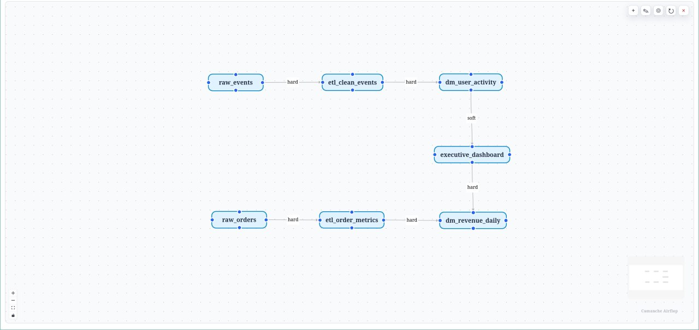
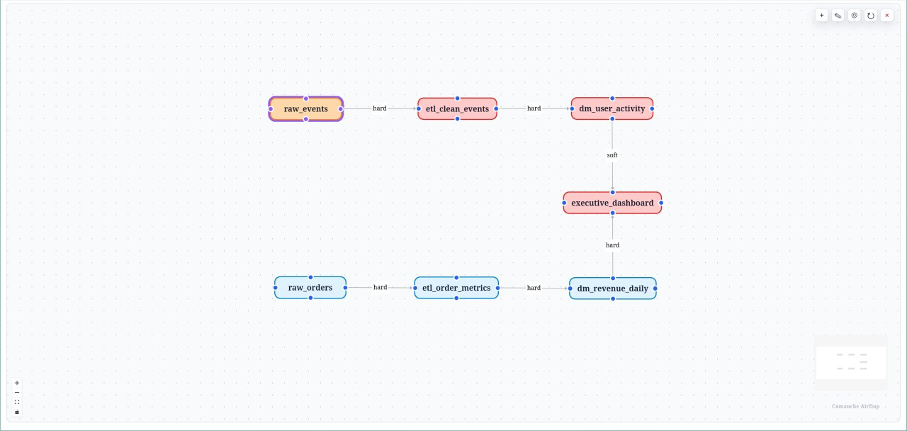
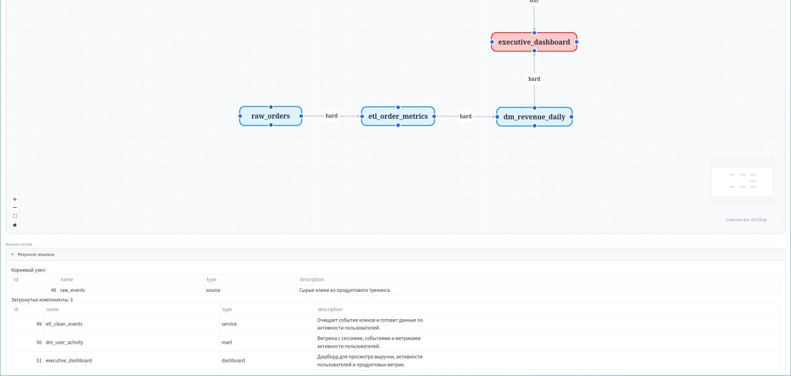

# Comanche Airflop

## О проекте

Comanche Airflop — интерактивная карта зависимостей для анализа влияния изменений в аналитической системе. Проект показывает, как источники данных, ETL-задачи, витрины и дашборды связаны между собой, и помогает быстро понять, какие компоненты затронет изменение выбранного узла.

В аналитике редко меняется только один объект. Если меняется источник данных, схема таблицы, ETL-логика или витрина, downstream-компоненты тоже могут потребовать проверку. Comanche Airflop решает эту задачу через граф: пользователь видит компоненты системы, направление зависимостей и результат анализа влияния.

Пользователь работает с graph canvas. На нём можно создавать компоненты, связывать их зависимостями, двигать узлы, переносить концы связей между сторонами узлов и запускать анализ влияния. Backend хранит граф в PostgreSQL, а frontend показывает его через React Flow.

Версия 0.1.0 — первая рабочая версия проекта. В неё входят локальный запуск через Docker Compose, FastAPI backend, Streamlit frontend, интерактивный canvas, CRUD для компонентов и зависимостей, handle-точки у узлов, перенос концов связей и анализ downstream impact.

## Стек

Python, Streamlit, FastAPI, PostgreSQL, React, TypeScript, React Flow, Docker Compose.

## Структура репозитория

Backend лежит в папке backend. Streamlit-приложение лежит в папке frontend. React-компонент canvas лежит в frontend/graph_canvas/frontend. SQL-схема базы лежит в backend/init.sql. Docker Compose поднимает PostgreSQL, FastAPI backend и Streamlit frontend.

.
├── backend
│   ├── analysis.py
│   ├── db.py
│   ├── init.sql
│   ├── main.py
│   ├── requirements.txt
│   └── schemas.py
├── frontend
│   ├── api.py
│   ├── app.py
│   ├── app_state.py
│   ├── canvas_data.py
│   ├── canvas_events.py
│   ├── graph_canvas
│   │   ├── component.py
│   │   └── frontend
│   │       ├── dist
│   │       └── src
│   ├── requirements.txt
│   └── ui_sections.py
├── docs
│   └── images
│       ├── canvas-overview.png
│       └── impact-analysis.png
├── docker-compose.yml
├── CHANGELOG.md
├── LICENSE
├── README.md
└── VERSION

## Скриншоты

Ниже показан основной граф. В нём есть источники данных, ETL-задачи, витрины и dashboard.

Ниже показан выбранный компонент перед запуском анализа влияния.

Ниже показан результат анализа. Проект подсвечивает корневой компонент и downstream-компоненты, которые зависят от него.

## Что входит в версию 0.1.0

В версии 0.1.0 проект закрывает основной локальный сценарий работы с картой зависимостей.

Пользователь может:

* создавать компоненты системы;
* редактировать и удалять компоненты;
* создавать зависимости между компонентами;
* редактировать и удалять зависимости;
* задавать тип связи: hard или soft;
* двигать узлы на canvas;
* двигать canvas через trackpad pan;
* менять масштаб через pinch zoom;
* создавать связи через handle-точки;
* переносить концы связей на другой узел или другую сторону узла;
* запускать анализ влияния по выбранному компоненту;
* видеть корневой и затронутые компоненты после анализа.

Backend хранит компоненты, зависимости, типы связей, source_handle и target_handle. Благодаря этому связь остаётся на выбранной стороне узла после перезагрузки страницы.

## Как работает проект

Маршрут работы выглядит так:

1. Streamlit показывает интерфейс и встраивает React Flow canvas.
2. React Flow показывает граф, принимает клики, drag, pan, zoom и перенос концов связей.
3. Canvas отправляет событие в Streamlit, когда пользователь создаёт компонент, меняет связь или запускает анализ.
4. Streamlit вызывает FastAPI backend.
5. FastAPI проверяет данные и сохраняет их в PostgreSQL.
6. PostgreSQL хранит компоненты и зависимости.
7. Анализ влияния строит направленный граф и ищет downstream-компоненты от выбранного узла.

Так проект разделяет роли: React Flow отвечает за графический editor, Streamlit связывает UI и backend, FastAPI работает с API, PostgreSQL хранит состояние графа.

## Основные решения

### Компоненты

Компонент описывает объект аналитической системы. Это может быть источник данных, ETL-задача, витрина, сервис, отчёт или dashboard.

Таблица components хранит название, тип и описание компонента. Название помогает читать граф, тип показывает роль узла, а описание даёт короткий контекст.

### Зависимости

Зависимость задаёт направление связи между двумя компонентами. Таблица dependencies хранит source_component_id и target_component_id.

Поле source_component_id задаёт компонент, от которого идёт влияние. Поле target_component_id задаёт компонент, который зависит от исходного компонента.

Например, связь raw_events → etl_clean_events означает, что ETL-задача использует raw_events. Если raw_events меняется, etl_clean_events надо проверить.

### Тип связи

Связь может иметь тип hard или soft.

Hard-связь означает сильную зависимость. Если исходный компонент ломается или меняет контракт, downstream-компонент с высокой вероятностью тоже ломается.

Soft-связь означает слабую зависимость. Исходный компонент влияет на downstream-компонент, но не всегда ломает его полностью.

Так граф показывает не только направление влияния, но и силу зависимости.

### Handle-точки

У каждого узла есть handle-точки сверху, справа, снизу и слева. Через них React Flow соединяет узлы.

Backend хранит source_handle и target_handle. Эти поля задают стороны узлов, к которым крепится связь. Поэтому пользователь может перенести конец связи на другую сторону узла, а приложение сохранит этот выбор.

### Анализ влияния

Анализ влияния получает выбранный компонент и идёт по направленным связям. Он ищет компоненты, которые зависят от выбранного узла напрямую или через цепочку других компонентов.

Если выбрать raw_events, проект найдёт ETL-задачи, витрины и dashboard, которые могут пострадать после изменения raw_events.

### Canvas

Canvas — главный рабочий экран проекта. Пользователь работает с графом напрямую: кликает по узлам, открывает контекстное меню, создаёт связи, двигает узлы и запускает анализ.

Такой интерфейс лучше подходит для карты зависимостей, чем набор таблиц. Граф сразу показывает структуру системы и направление влияния.

## Демо-граф

Для демонстрации проекта можно создать простой аналитический пайплайн.

Компоненты:

* raw_events — сырые события кликов;
* raw_orders — сырые события заказов;
* etl_clean_events — очистка событий;
* etl_order_metrics — расчёт метрик заказов;
* dm_user_activity — витрина активности пользователей;
* dm_revenue_daily — дневная витрина выручки;
* executive_dashboard — dashboard для ключевых метрик.

Связи:

* raw_events → etl_clean_events;
* raw_orders → etl_order_metrics;
* etl_clean_events → dm_user_activity;
* etl_order_metrics → dm_revenue_daily;
* dm_user_activity → executive_dashboard;
* dm_revenue_daily → executive_dashboard.

Такой граф показывает типичный путь данных: источники → ETL → витрины → dashboard. Если запустить анализ от raw_events, проект покажет цепочку etl_clean_events → dm_user_activity → executive_dashboard. Это и есть главный сценарий impact analysis: одно изменение в источнике может затронуть несколько downstream-объектов.

## Как запустить проект

### 1. Подготовьте окружение

Установите Docker и Docker Compose.

Проверьте Docker:

docker --version

Проверьте Docker Compose:

docker compose version

### 2. Склонируйте репозиторий

Склонируйте проект и перейдите в его корень:

git clone https://github.com/tadzhnahal/comanche-airflop
cd comanche-airflop

### 3. Поднимите сервисы

Запустите PostgreSQL, backend и frontend через Docker Compose:

docker compose up -d --build

После запуска посмотрите список контейнеров:

docker compose ps

В списке должны быть контейнеры backend, frontend и db.

### 4. Проверьте backend

Проверьте соединение backend с базой:

curl http://127.0.0.1:8000/health/db

Ожидаемый ответ должен содержать:

"status":"ok"

Проверьте корневой endpoint:

curl http://127.0.0.1:8000/

Backend должен вернуть базовый ответ сервиса.

### 5. Откройте frontend

Откройте Streamlit-приложение в браузере:

http://localhost:8501

После открытия появится graph canvas. На нём можно создать компоненты, добавить связи и запустить анализ.

## Как проверить результат

### 1. Создайте демо-граф

Откройте http://localhost:8501 и создайте компоненты:

* raw_events;
* raw_orders;
* etl_clean_events;
* etl_order_metrics;
* dm_user_activity;
* dm_revenue_daily;
* executive_dashboard.

После создания компонентов разложите их слева направо: источники, ETL-задачи, витрины, dashboard.

### 2. Создайте зависимости

Соедините компоненты так:

raw_events → etl_clean_events
raw_orders → etl_order_metrics
etl_clean_events → dm_user_activity
etl_order_metrics → dm_revenue_daily
dm_user_activity → executive_dashboard
dm_revenue_daily → executive_dashboard

Для основных связей выберите hard. Для связи dm_user_activity → executive_dashboard можно выбрать soft, чтобы показать разницу между сильной и слабой зависимостью.

### 3. Проверьте работу canvas

Перетащите несколько узлов. Узлы должны двигаться, а связи должны следовать за ними.

Затем возьмите конец связи и перенесите его на другую сторону узла. После этого перезагрузите страницу через Ctrl + Shift + R. Связь должна остаться на новой стороне. Это значит, что backend сохранил source_handle и target_handle.

### 4. Проверьте анализ влияния

Выберите компонент raw_events и запустите анализ влияния.

Проект должен показать цепочку влияния:

raw_events → etl_clean_events → dm_user_activity → executive_dashboard

Так можно проверить, что анализ идёт по downstream-зависимостям и находит не только прямые, но и косвенные связи.

### 5. Проверьте данные через API

Проверьте компоненты:

curl http://127.0.0.1:8000/components | python -m json.tool

Проверьте зависимости:

curl http://127.0.0.1:8000/dependencies | python -m json.tool

В ответе по зависимостям у каждой связи должны быть поля source_handle и target_handle. Эти поля отвечают за стороны узлов, к которым крепится связь на canvas.

## API

Backend поднимает FastAPI-сервис на порту 8000.

Основные маршруты:

* GET / — базовый ответ сервиса;
* GET /health/db — проверка соединения с PostgreSQL;
* GET /components — список компонентов;
* POST /components — создание компонента;
* PUT /components/{component_id} — редактирование компонента;
* DELETE /components/{component_id} — удаление компонента;
* GET /dependencies — список зависимостей;
* POST /dependencies — создание зависимости;
* PUT /dependencies/{dependency_id} — редактирование зависимости;
* DELETE /dependencies/{dependency_id} — удаление зависимости;
* POST /analysis/run — запуск анализа влияния.

Swagger UI доступен по адресу:

http://127.0.0.1:8000/docs

## База данных

Проект использует PostgreSQL и создаёт две основные таблицы: components и dependencies.

Таблица components хранит компоненты графа.

Основные поля:

* id — идентификатор компонента;
* name — название компонента;
* component_type — тип компонента;
* description — описание компонента;
* created_at — время создания.

Таблица dependencies хранит связи между компонентами.

Основные поля:

* id — идентификатор зависимости;
* source_component_id — исходный компонент;
* target_component_id — целевой компонент;
* dependency_type — тип связи: hard или soft;
* source_handle — сторона исходного узла;
* target_handle — сторона целевого узла;
* created_at — время создания.

Поля source_handle и target_handle нужны для canvas. Они позволяют сохранить конкретные стороны узлов, к которым привязана связь.

## Как остановить проект

Остановите контейнеры:

docker compose down

Эта команда остановит сервисы, но сохранит данные PostgreSQL в Docker volume.

Если нужно полностью удалить данные, выполните команду:

docker compose down -v

Эта команда удалит volume PostgreSQL. После неё созданные компоненты и зависимости пропадут.

## Дальнейшие шаги

В следующих версиях можно добавить сохранение layout в backend, экспорт графа в JSON, импорт графа из файла, роли пользователей, тесты API, отдельные рабочие пространства и историю изменений графа.

## Лицензия

Проект распространяется под лицензией MIT. Текст лицензии лежит в файле LICENSE.
